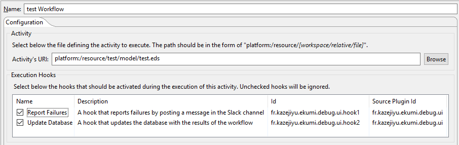

Monitor Executions
#############################

.. important:: This section requires some knowledge about `Eclipse Extension Points <https://www.vogella.com/tutorials/EclipseExtensionPoint/article.html>`_.

Why monitoring executions?
------------------------------

Monitoring executions allows developers to enhance the execution engine or to connect it to other tools. For instance, one could monitor executions in order to:

- show ongoing executions in an online dashboard,
- notify user by e-mail or Slack when an execution fails,
- update a database with the result of the execution.

Executions can be monitored by registering **execution hooks**.

How to register a new execution hook?
-------------------------------------

An execution hook can be registered by contributing a new ``hook`` element to the ``fr.kazejiyu.ekumi.core.execution`` extension point.

This element needs the following attributes:

======================  ====================================================
Attributes               Purpose
======================  ====================================================
id                       Uniquely identifies the hook
class                    An instance of the ``ExecutionHook`` interface
name                     Human-readable name displayed in UI
description              Details of what the hook does, displayed in UI
activated by default     (Optional) Indicates whether the hook should be notified by default
======================  ====================================================

When the user executes an activity, he can select the hooks that should be notified. The ``activated by default`` attribute indicates whether the hook is selected by default. The following screenshot shows the Run Configuration tab that allows the user to select available hooks:

How to implement a new execution hook?
---------------------------------------

A new hook is implemented by creating a class that implements the ``ExecutionHook`` interface. This interface provides a lot of methods to react on specific events but their default behavior is to do nothing so you can only override the ones you are interested in.

The following class defines a hook that prints messages when an execution starts, ends, and when an activity fails:

.. code-block:: java
   :linenos:

    import fr.kazejiyu.ekumi.core.execution.listeners.ExecutionHook;
    import fr.kazejiyu.ekumi.core.workflow.Activity;
    import fr.kazejiyu.ekumi.core.workflow.Execution;

    public class PrintsExecutionStepsToConsole implements ExecutionHook {

        @Override
        public String id() {
            // Must be equal to the id specified in the plugin.xml file
            return "fr.kazejiyu.ekumi.ide.hooks.example1";
        }

        @Override
        public void onExecutionStarted(Execution execution) {
            System.out.println("The execution " + execution.name() + " has started on " + execution.startDate());
        }

        @Override
        public void onExecutionSucceeded(Execution succeeded) {
            System.out.println("The execution " + succeeded.name() + " has finished successfully on " + succeeded.endDate());
        }

        @Override
        public void onActivityFailed(Activity failed) {
            System.out.println("The activity " + failed.name() + " has failed");
        }

    }