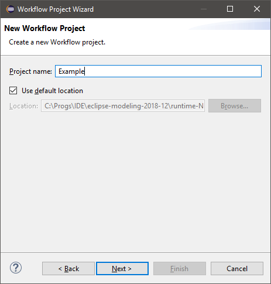
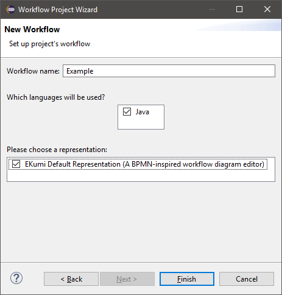
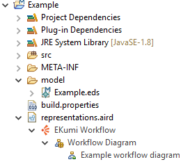

Create a new Workflow project
##############################

Use the `New Workflow Project` wizard
-------------------------------------

The simplest way to create a new Workflow project is to use the dedicated wizard. It can be opened from ``File`` > ``New...`` > ``Workflow Project``.

The wizard first asks for the name of the new project. Fill in the text field then press ``Next``.

The second page asks the user to choose:

- the name of the workflow (which, by default, is the same as the name of the project),
- the scripting languages enabled for this workflow,
- the representation.

Enable scripting languages
--------------------------

Scripting languages are used to specify the behaviour of a task at runtime. A scripting language is typically kind of an interpreter able to execute a script associated with a task.

.. tip:: See **Available Scripting Languages** for an overview of available scripting languages.

Several scripting languages can be selected at once for a project. In the context of this tutorial just select ``Java``; if Java is not available, please see :ref:`part-installing`.

.. important:: It is currently impossible to enable new scripting languages in an existing project. Take care to the languages you select during the creation of the projects.

Choose a representation
-----------------------

A representation defines the way an activity can be seen. A representation is usually associated with an editor providing tools to modify the activity.

These editors can take any shape: it can be a diagram editor, a textual DSL or even a GUI with text fields and buttons. It is important to pick a representation which is relevant to your goal because it will define the way you design the activity.

.. tip:: See **Available Representations** for an overview of available representations.

Currently only one representation is allowed per project. Select ``EKumi Default Representation``.

Create the project
------------------

When the setup is done, click on ``Finish``. Wait a few seconds to see the project being added to the Explorer.

.. tip:: See the :ref:`part_java_language` and :ref:`part_ekumi_default_representation` for a detailed presentation of the project's content.

You are now ready to design your first activity.