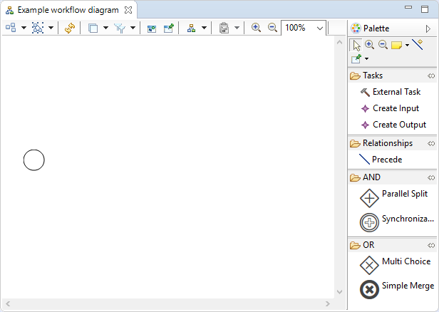
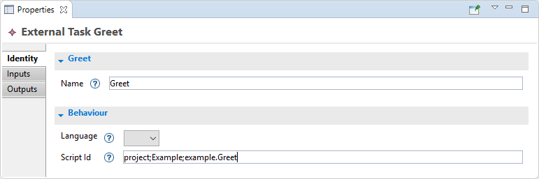

Design an activity
###################

Open the diagram editor
-----------------------

In order to open the diagram editor:

1. Unfold the `representations.aird` file
2. Double-click on `Example workflow diagram`

The following view should open:

Understand the diagram editor
-----------------------------

The workflow diagram editor is made of two parts:

- the edition area, which is the blank area on the left,
- the palette, which is the section on the right.

The edition area provides a visual representation of the workflow. Tools can be applied on it in order to modify the representation.

The circle represents the start node, which is the entry point of the workflow when it is executed.

The palette provides access to the different tools that can be used to modify the workflow. A tool can be used by:

1. Clicking on the tool in the palette
2. Clicking on the edition area

.. tip:: See :ref:`part_ekumi_default_representation` for an in-depth presentation of available tools.

Create a Greeting task
----------------------

.. |external-task-tool| image:: ../available-representations/images/external_task_tool.png

A new Task can be created thanks to the |external-task-tool| tool:

1. Click on the tool
2. Click somewhere in the edition area

A new box appears on the editor, representing the new task.

Open the ``Properties`` view, select the task, then type "Greet" in the `Name` text field.

In order to add behavior to this task we have to link it to a Java script. To this end:

1. Select ``Java`` in the `Languages` drop-down menu
2. Type "project;<the_name_of_your_project>;example.Greet" in the `Script Id` text field

.. note:: The `Script Id` fields allows EKumi to resolve the script to run. The UI will evolve in the future so that users won't have to type it by hand anymore.

Then create a new Java class called ``Greet`` in the `example` package that prints something to the console.

.. code-block:: java
   :linenos:

    package example;

    import fr.kazejiyu.ekumi.core.workflow.Context;
    import fr.kazejiyu.ekumi.core.workflow.gen.impl.RunnerImpl;

    public class Greet extends RunnerImpl {

	    @Override
	    public void run(Context context) {
		    System.out.println("Hello!");
	    }

    }

.. todo:: Build a more complex activity with two tasks, one producing outputs and another consuming them.

Now that the activity is ready, it can be executed.