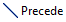

Execute an activity
###################

Link the task to the start node
-------------------------------

First of all, the ``Greet`` task must be linked to the start node, otherwise it won't be considered as a runnable task.

To this end, use the |precede-tool| tool:

1. Click on the tool
2. Click on the start node
3. Click on the task

Launch the execution
--------------------

Then you can create a new Run configuration:

1. ``Run`` > ``Run Configurations...``
2. Double-click on `Workflow`
3. Click on `Browse`
4. Select `model/Example.eds`
5. Click on `Run`

**Hello!** should be printed to the console.

.. todo: Explain more in details and add screenshots.